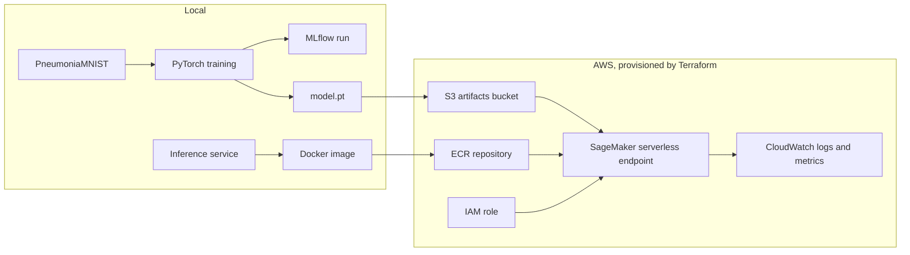

# MedOps Lite

MedOps Lite is a small MLOps learning project for the Materialise MLOps Engineer interview. It takes the public PneumoniaMNIST dataset through a reproducible PyTorch training pipeline, records an MLflow run, packages inference in Docker, and provides Terraform for AWS storage, ECR, IAM, and an optional SageMaker endpoint.

This is an educational project. The dataset and baseline model are not suitable for clinical decisions.

## Architecture



## Exploratory data analysis

After running `make train`, open `notebooks/01_data_eda.ipynb` in VS Code and select the project `.venv` kernel. It summarizes the downloaded splits, label balance, sample images, and raw pixel distributions.

## Run locally

```bash
uv sync
make test
make train
```

`uv sync` creates the project environment from `pyproject.toml` and the committed `uv.lock` file. Run training directly with `uv run medops-train`, or use `make train`. Set the epoch count with `uv run medops-train --epochs 10` or `EPOCHS=10 make train`. Training uses class-weighted loss and selects the best validation-F1 checkpoint.

Training downloads PneumoniaMNIST into `data/` and writes `artifacts/model.pt` and `artifacts/metrics.json`. MLflow records local runs in `mlflow.db`.

To run local HTTP inference after training:

```bash
uv run medops-predict --serve --model artifacts/model.pt
```

The service exposes `GET /ping` and `POST /invocations`. The request body is JSON with an `image_base64` field.

To predict a single image:

```bash
uv run medops-predict path/to/image.png --model artifacts/model.pt
```

## Docker

```bash
docker build -t medops-lite:local .
docker run --rm -p 8080:8080 -v "$PWD/artifacts:/opt/ml/model" \
  medops-lite:local --serve --model /opt/ml/model/model.pt
```

The image is also suitable as a starting point for a SageMaker custom inference container. A production image would need a fuller request contract, authentication, structured logging, and a controlled model-loading path.

## AWS path

The Terraform configuration defaults to storage-only mode to avoid accidentally creating a billable endpoint. The optional deployment uses SageMaker Serverless Inference because this demo expects infrequent traffic. It scales to zero when idle, avoiding the cost of a continuously running instance. The first request after an idle period may be slower because the endpoint has to start.

```bash
cd terraform
terraform init
terraform plan
terraform apply
terraform output
```

Tag the Docker image with an immutable version such as a Git SHA and push it to the ECR URL from the outputs. Package the model as `model.tar.gz` and upload it to a versioned key such as `models/<mlflow-run-id>/model.tar.gz` in the artifacts bucket. Set `image_tag` and `model_artifact_key` in a local `.tfvars` file. Terraform creates a new SageMaker model and endpoint configuration when either value changes, so the image and model can be released independently. Leave both empty to keep storage-only mode.

The serverless endpoint uses 2 GB of memory and accepts up to two concurrent requests. Destroy the resources afterwards:

```bash
terraform destroy
```

The Terraform role lets SageMaker read the model from S3, pull the inference image from ECR, and write logs and metrics to CloudWatch. Terraform retains endpoint logs for 14 days and removes the log group on destroy. The artifacts bucket uses server-side S3 encryption and versioning, but deployments use the Git SHA in the object key rather than relying on S3 versions. Production would use tighter resource-level permissions, private networking, secret management, lifecycle policies, and an approved account structure.

## Monitoring demo

The minimum monitoring story is:

- Infrastructure: endpoint health, request errors, latency, and container logs.
- Data: malformed images, unexpected dimensions, and input distribution changes.
- Model: confidence, delayed evaluation metrics, manual corrections, and performance by relevant subgroup or acquisition source.

Run `python -m src.monitor path/to/image.png` against the local service to send normal, brightness-shifted, unexpected-dimension, and malformed inputs. The resulting JSON is a smoke-monitoring report, not proof of clinical drift.

## Limitations and regulated-product differences

- PneumoniaMNIST is a small educational dataset, not a clinical validation set.
- The split and labels are inherited from the public dataset; patient-level leakage and population shift must be investigated before real use.
- The baseline CNN has no calibration, fairness analysis, external validation, or human-review workflow.
- A regulated product would require documented intended use, traceability across data/code/model versions, formal verification and validation, privacy controls for DICOM/PHI, audit trails, controlled release, rollback, and post-market monitoring.
- EKS is intentionally outside the core implementation. It is a reasonable extension when Kubernetes-specific scheduling, multi-service deployment, or an existing cluster is a real requirement.

## Interview demo

1. Run `make test` and `make train`.
2. Open the MLflow run and show parameters, metrics, and the model artifact.
3. Build the Docker image and explain the reproducibility boundary.
4. Show the Terraform resources and cost-safe default.
5. Send one inference request and show `/ping` plus container logs.
6. Explain how model, data, and infrastructure monitoring differ, then describe rollback.
